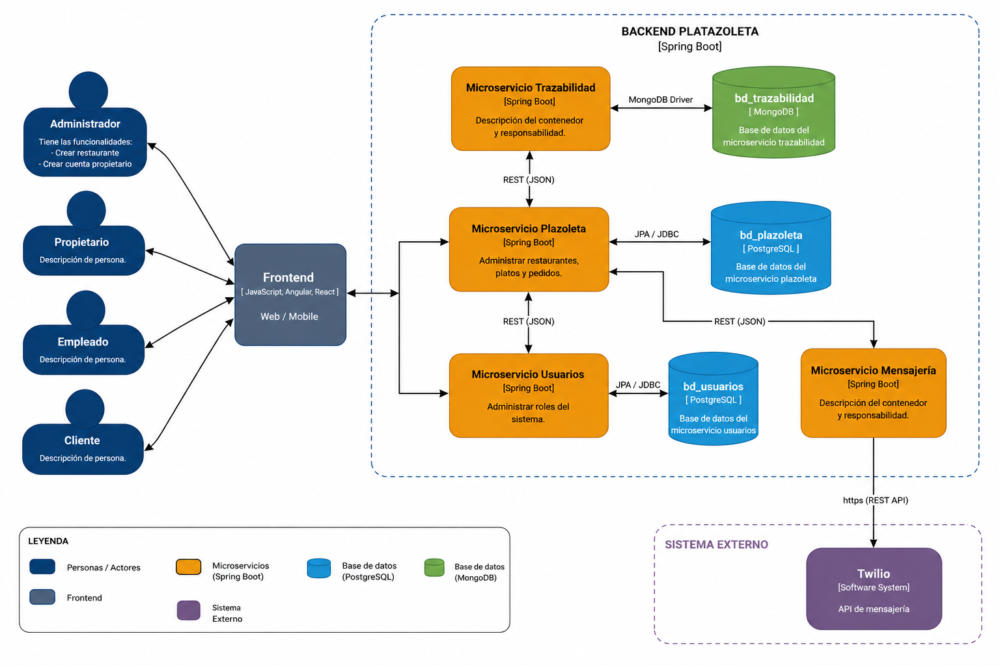

# Plaza de Comidas - Backend

Sistema backend basado en microservicios para la administración de una plazoleta de comidas.

El proyecto fue desarrollado con:

- Spring Boot
- Scaffold Bancolombia (Clean Architecture)
- PostgreSQL
- MongoDB
- JWT + Spring Security
- Twilio API

> El sistema está dividido en microservicios independientes siguiendo principios de Clean Architecture.

---

# Microservicios

| Microservicio | Descripción | Base de Datos |
|---|---|---|
| Restaurant Service | Gestión de restaurantes, platos y pedidos | PostgreSQL |
| User Service | Gestión de usuarios y roles | PostgreSQL |
| Traceability Service | Trazabilidad e historial de pedidos | MongoDB |
| Messaging Service | Envío de notificaciones SMS | Externa |

---

# Arquitectura



El proyecto utiliza el Scaffold Bancolombia basado en Clean Architecture:

- **Domain:** reglas y modelos de negocio.
- **UseCases:** lógica de aplicación.
- **Infrastructure:** adaptadores, persistencia y APIs externas.
- **Application:** configuración e inicio de Spring Boot.

---

# Flujo de Pedidos

Estados del pedido:

```text
PENDIENTE -> EN_PREPARACION -> LISTO -> ENTREGADO
```

También existe el estado:

```text
CANCELADO
```

Reglas principales:

- Un cliente solo puede tener un pedido activo.
- Solo se puede cancelar un pedido en estado `PENDIENTE`.
- Cuando el pedido está `LISTO`, se envía un PIN vía SMS.
- La trazabilidad registra el tiempo en cada estado.

---

# Seguridad

La autenticación y autorización se implementaron con:

- Spring Security
- JWT

---

# Repositorios

## Restaurant Service

https://github.com/Gibson-Arbey/ms-restaurant-clean-architecture

## User Service

https://github.com/Gibson-Arbey/ms-user-clean-architecture

## Traceability Service

https://github.com/Gibson-Arbey/ms-traceability-clean-architecture

## Messaging Service

https://github.com/Gibson-Arbey/ms-messaging-clean-architecture

---

# Ejecución

```bash
./gradlew bootRun
```

---

# Tecnologías

- Java 21
- Spring Boot
- PostgreSQL
- MongoDB
- Gradle
- JWT
- Twilio

---

# Autor

Gibson Rodríguez